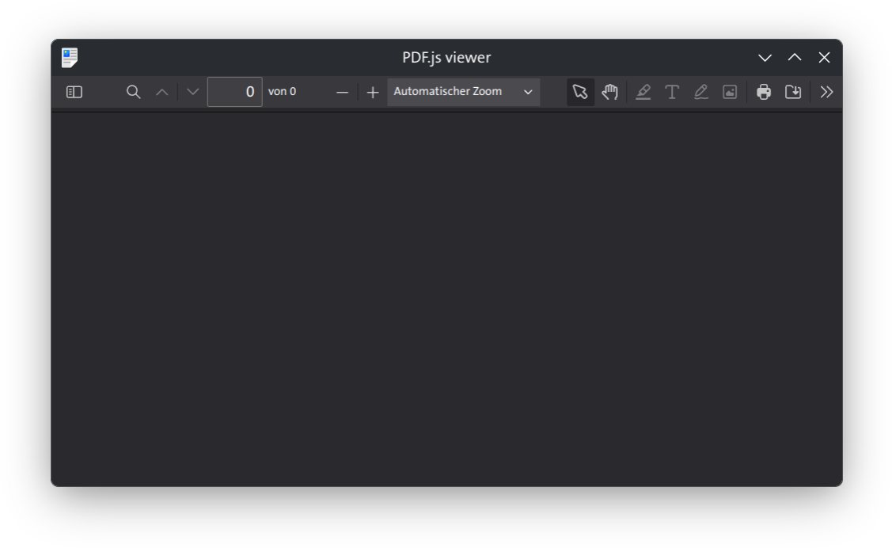
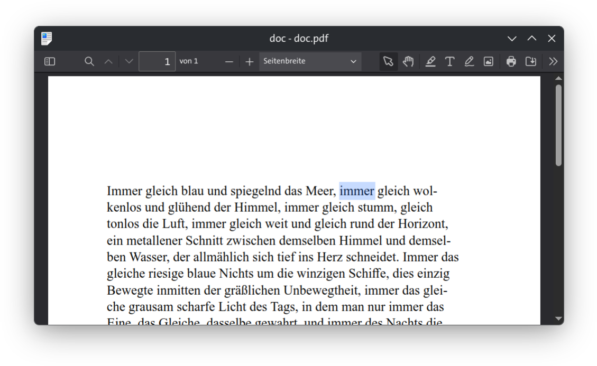
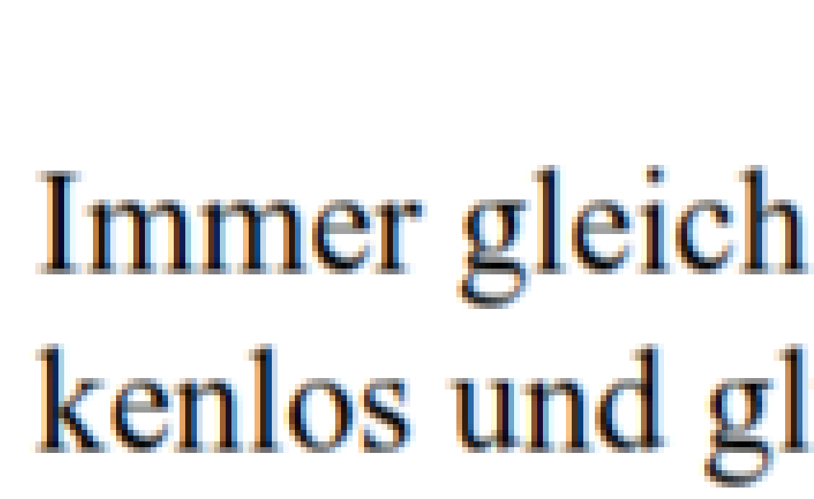

# pdfviewer
Lightweight PDF Viewer using PDF.js and Qt for Linux

Code generated with Claude. No credit on my side.

## Features
- Fully featured, standalone PDF viewer
- Excellent PDF rendering with subpixel rendering
- Fast and clean compilation
- Page reloading (TODO)
- Print dialog

## Main differences from Okular
- Better text rendering on lower-resolution screens
- More PDF editing features (adding text and images)
- Sane default printer settings
- Slightly slower than Okular due to the underlying JavaScript layer. Barely noticeable on modern machines.

## Screenshots

I love Okular, though, and have been using it for years. I especially like the typical KDE flexibility when it comes to toolbar customization.

My main complaints are the lack of subpixel rendering and the limited PDF redacting capabilities. PDF.js handles these aspects noticeably better.

Tested on Fedora 44 Plasma Edition.
